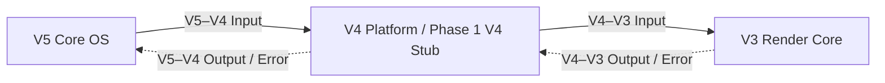

# Phase 1 V5–V3 Vertical Slice Architecture Review

> 任务：`ACS-P1-006`
> 状态：技术无关的架构边界评审；不是 V5–V3 直接契约，也不构成实现授权。
> 基线：AI Cinematic Studio V2.3。

## 1. 评审目的与结论

本文评审 Phase 1 第一条 V5 Core OS 至 V3 Render Core 生产链的端到端信息语义，定义 Project、Production Intent、Shot、Render Request、Render Result 与 Asset Return 的最小边界，并说明 Asset 如何作为输入进入 Render、输出候选如何返回 Asset 体系。

本文的 “V5 → V3” 与 “V3 → V5” 只表示跨两条相邻契约的**信息方向和语义血缘**。它们不是直接调用、直接依赖、共享数据模型或回调关系。实际生产依赖仍严格遵守：

`V5 Core OS → V4 Platform → V3 Render Core → Compute`

评审结论是：该 Vertical Slice 在保留 V4 相邻中介、分别建立 V5–V4 与 V4–V3 具体契约的前提下，与 V2.3 方向一致；当前仍有阻断性 Open Questions，因此本文不批准代码、接口实现或 Production Validation 候选。

## 2. 不可破坏的架构约束

虚线只表示结果或错误沿既有调用上下文逐层返回，不表示下层获得对上层的生产依赖。

| 约束 | 评审要求 |
| --- | --- |
| 相邻依赖 | V5 只依赖 V4 公开契约；V4 只依赖 V3 公开契约；V3 不直接了解或调用 V5 |
| 返回方向 | V3 信息先作为 V4–V3 Output/Error 返回 V4，再作为 V5–V4 Output/Error 返回 V5 |
| 契约独立 | V5–V4 与 V4–V3 必须分别定义 Purpose、Input、Output、Error、Ownership 与兼容性，禁止共享端到端 DTO |
| V4 Stub | 必须可识别、可移除、无长期权威状态和额外业务决策；具体映射行为仍需独立契约确定 |
| 标识传播 | Request ID、Trace ID、Project ID 与适用 Asset ID 保持不透明和来源语义；不得由标识推断权限、版本或位置 |
| 数据责任 | 信息经过某层不转移 Project、Production、Asset 或 Render 数据所有权 |
| 实现隔离 | 不定义协议、端点、Schema、存储、Job、Worker、渲染引擎、Compute 实现或部署拓扑 |

依据包括 [系统上下文](../../architecture/system-context.md)、[层级依赖图](../../architecture/dependency-map.md)、[V5–V4 契约模板](v5-v4-contract.md)、[V4–V3 契约模板](v4-v3-contract.md)及 [Phase 1 Production Validation Plan](../12-release/phase-1-production-validation-plan.md)。

## 3. 六个概念的最小定义

| 概念 | 本评审中的最小含义 | 责任边界 | 明确不表示 |
| --- | --- | --- | --- |
| **Project** | 为本次生产和渲染语义提供已识别、不可混淆的项目上下文 | V5 在上游语境中提供既有 Project ID；V3 只保留不透明关联 | V3 Project 实体、所有权、成员关系、权限范围或数据库记录 |
| **Production Intent** | 对期望生产结果、适用输入和约束的技术无关声明 | V5 解释完整上层意图，并只向 V4 提交获批的最小下游投影 | 工作流、状态机、Prompt Schema、执行计划、Job 或 Worker 指令 |
| **Shot** | 在 Project 与 Production 语境中组织一次可讨论渲染输入和结果的概念单元 | V5 保持其上层含义；V3 只消费正式契约允许的 render-facing 上下文 | 已存在的实体、Shot ID、时间线节点、数据库行或流程步骤 |
| **Render Request** | V4 通过 V4–V3 公开边界提交给 V3 的最小渲染相关输入语义 | V3 定义可接受的渲染边界条件；V4 负责按相邻契约提交 | V5–V3 共享对象、API Request、Job、队列消息或 Compute 调度命令 |
| **Render Result** | V3 对一次 Render Request 形成的稳定、可观察结果或失败语义 | V3 通过 V4–V3 Output/Error 返回；V4 再按 V5–V4 契约映射 | Asset、文件路径、存储地址、Job 状态、成功枚举或原始 Compute 对象 |
| **Asset Return** | 输出候选及关联语义经 V4 返回上游，供另行获批的 Asset 权威责任边界判断是否接纳与登记的端到端动作 | V3 只返回候选结果；本评审不分配 Asset 权威 owner，接纳责任必须由获批所有权记录和契约确定 | V3 直接写 Asset Registry、上传协议、自动产生 Asset ID 或已完成 Asset 登记 |

这些定义只建立评审词汇，不创建业务实体、字段、标识格式、基数、生命周期或数据所有权记录。

## 4. V5、V4 与 V3 职责

### 4.1 V5 Core OS

V5 在本 Slice 中负责：

- 保持 Project、Production Intent 与 Shot 的上层语义，不把 UI 或 V5 内部对象传到下层；
- 根据未来获批契约选择本次意图适用的 Asset 引用，并保持 Project ID、Asset ID、Request ID 与 Trace ID 的关联语义；
- 向 V4 提交最小 render-facing intent，而不是 V3 Render Request 的内部表示；
- 只消费 V4 公开返回的稳定结果或错误，不解析 V3、Compute 或 V4 Stub 私有状态；
- 只按 V5–V4 返回契约检查关联连续性与契约完整性，并将候选提交给另行获批的 Asset 权威责任边界；V5 所在层级不因此自动取得接纳、登记或关联决定权；
- 在结果尚未被获批权威边界接纳前，不得将其声明为 Asset 事实。

V5 不负责选择渲染引擎、资源、Worker、队列、Compute 步骤、物理存储或 V3 内部执行方式，也不得直接依赖 V3。

### 4.2 V4 Platform / Phase 1 V4 Stub

V4 是不可跳过的相邻中介：

- 接受 V5–V4 契约输入，并仅通过 V4–V3 公开契约依赖 V3；
- 保持获批的关联标识、成功、失败和最小披露语义；
- 不把 V5 内部对象原样暴露给 V3，也不把 V3 或 Compute 内部对象原样返回 V5；
- 不成为 Project、Production Intent、Shot、Asset、Render Request 或 Render Result 的权威来源；
- 不引入长期状态、调度、业务决策或永久平台承诺。

V4 是保持、裁剪还是转换哪些语义，以及各项验证责任，必须由两条具体相邻契约确定；本评审不把 Stub 预设为透明代理、编排器或长期 V4 实现。

### 4.3 V3 Render Core

V3 在本 Slice 中负责：

- 只从 V4 公开边界接收 Render Request；
- 验证正式 V4–V3 契约规定的渲染边界完整性与支持范围；
- 将 Project、Shot 和输入 Asset 只视为不透明关联或渲染上下文，不查询或修改其上层事实；
- 如需下层计算能力，只有在具体 `V3 Render Core → Compute` 契约另行获批后，才能通过该相邻公开边界表达需求；当前契约文档只是模板，不构成调用授权；
- 形成稳定 Render Result 或安全错误，并保留适用关联上下文；
- 封装 V3 与 Compute 内部表示，不向 V4 或 V5 泄漏实现细节。

V3 不负责 Project 或 Production 规则、Asset 权威登记、Rights、Permission、Provenance、版本选择、业务 Workflow 或对 V5 的反向调用。

## 5. V5 → V3 端到端信息边界

该方向由两个不同的相邻输入契约构成，不存在可由 V5 与 V3 共同依赖的单一消息模型。

| 语义组 | V5 → V4 责任 | V4 → V3 责任 | V3 可依赖的含义 | 禁止推断 |
| --- | --- | --- | --- | --- |
| 请求关联 | 提供或传播适用 Request ID、Trace ID | 按相邻契约保持关联，不静默替换 | 可将结果和错误关联到本次请求语境 | 执行状态、幂等、身份或授权 |
| Project 上下文 | 在适用且来源明确时提供既有 Project ID | 保持不透明语义并按 V4–V3 适用性提交 | 结果可关联至相同项目语境 | Project 存在性、所有权、成员或访问许可 |
| Production Intent 投影 | 表达期望结果和约束的最小下游语义 | 依据获批契约验证、裁剪或映射；具体责任待定 | 只解释 render-facing intent | V5 内部业务模型、完整 Production 语义或 Workflow |
| Shot 上下文 | 提供 Shot 的适用概念上下文；稳定身份仍待决 | 只传递 V3 契约明确需要的部分 | 组织本次渲染输入和结果语境 | Shot 实体、状态、时间线或权限 |
| 输入 Asset 引用 | 选择适用的既有 Asset ID；版本与可渲染内容仍待决 | 保持身份并满足 V3 输入契约 | 可关联渲染输入候选 | 路径、格式、版本、内容可用性、Rights 或 Permission |
| 输出期望 | 表达可观察结果目标和适用限制 | 映射为 V3 可验证的渲染边界语义 | 用于判断 Request 是否完整和受支持 | 引擎、模型、资源、供应商或 Compute 步骤 |
| 兼容与范围 | 标明所用获批契约和候选范围 | 拒绝未获批或不可安全映射的语义 | 只依赖已声明的 V4–V3 稳定承诺 | V4 私有规则、未来兼容或默认降级 |

上表是语义检查表，不是字段清单、DTO、Payload、API 或序列化设计。两条具体契约必须分别决定必需、条件、不适用、未知和拒绝语义。

## 6. V3 → V5 端到端返回边界

该方向只表示 Output/Error 逐层返回，不建立 `V3 → V5` 调用、事件直达、Callback 或反向依赖。

| 返回语义 | V3 → V4 | V4 → V5 | V5 可以稳定解释的内容 | 不得暴露或宣称 |
| --- | --- | --- | --- | --- |
| 关联上下文 | 返回适用 Request、Trace、Project 与输入 Asset 关联 | 保留仍适用的关联并按最小披露映射 | 结果属于哪个已知请求语境 | 权限、内部拓扑或不存在的标识 |
| Render Result | 返回 V4–V3 契约允许的可观察结果 | 映射为 V5–V4 契约结果 | 有输出候选可进入后续接纳判断 | 已是 Asset、已持久化、已验证或已可用 |
| 输出候选证据 | 返回后续边界判断所需的最小技术证据或不透明引用 | 只返回 V5 获批需要的稳定语义 | 可以评估候选是否满足下一边界前置条件 | 文件路径、凭据、供应商对象或 Compute 内部结果 |
| 限制与警示 | 返回安全、稳定且允许披露的限制 | 保持含义或安全收敛 | 结果仍有哪些已知限制 | 原始日志、堆栈、敏感输入或内部异常 |
| Error | 按 V4–V3 契约返回该边界拥有的稳定失败语义和调用方动作 | 翻译为 V5–V4 契约自身拥有的错误语义；任何信息收敛必须显式 | 未形成可接纳结果，或结果仍未知，以及 V5–V4 契约允许的动作 | V3/Compute 错误对象、自动重试许可、回滚完成或虚假成功 |

本文不选择同步、事件、轮询或其他异步机制。若未来需要异步交互，仍须分别在 `V5 → V4` 与 `V4 → V3` 两个相邻边界建立独立获批的适用契约；任何机制均不得使 V3 绕过 V4 直接触达 V5。

## 7. Asset 如何进入 Render

1. V5 在既有 Project 与 Production Intent 语境中选择适用的 Asset 引用；Project-Asset 关系只可作为关系上下文，不能替代存在性、权限或版本判断。
2. V5 只向 V4 提交既有、适用且来源明确的 Asset ID，不在标识中编码路径、格式、版本或业务状态。
3. V4 依据独立 V5–V4 与 V4–V3 契约保持或映射 Asset 关联，不把上游 Asset 权威边界的内部模型共享给 V3。
4. V3 只把 Asset ID 视为不透明输入关联；Asset ID 本身不足以证明内容可读、可渲染、版本确定或使用权成立。
5. 渲染所需的精确 Asset Version、内容物化、完整性和安全访问方式必须由后续获批契约解决；本文不以路径、URL、对象存储、共享数据库或隐式“最新版本”填补空白。
6. 在上述前置条件未关闭前，Vertical Slice 不能宣称 Asset 已经具备可执行的 Render 输入闭环。

## 8. Render 结果如何进入 Asset 体系

1. V3 形成 Render Result 候选或稳定 Error，并保持适用的请求、Project 和输入 Asset 关联。
2. 结果先通过 V4–V3 Output/Error 返回 V4，再由 V4 按 V5–V4 Output/Error 返回 V5；不存在 V3 直接写入 V5 的路径。
3. V5 侧只把成功返回视为待接纳候选，并按 V5–V4 契约检查关联连续性、契约完整性、已知限制和结果是否仍为未知或部分状态；该检查不产生 Asset 权威事实。
4. 输出候选只有在具有获批所有权记录的 Asset 权威责任边界完成接纳和登记后，才能获得权威 Asset 身份或版本语义。
5. 本评审不决定结果应成为新 Asset、既有 Asset 的新版本还是零至多个候选，也不指定哪个具体模块首次建立结果 Asset ID。
6. 如后续获批登记结果 Asset，Project 关系只能在 Asset 身份成立后按独立关系责任登记；失败、部分完成或不可判定结果不得产生虚假 Asset。
7. 输入、Render Request、Render Result 与结果 Asset 之间需要可追溯关联，但本文不实现 Provenance Ledger，也不把时间戳或 Trace ID 等同于血缘证据。

因此，Asset Return 是“结果候选沿相邻边界返回，并提交给另行获批的 Asset 权威责任边界接受治理判断”的边界动作，不是“V3 已经创建 Asset”的同义词。

## 9. Error、关联与结果未知

- 两条相邻契约必须分别遵守 [错误码标准](error-code-standard.md)，定义稳定失败语义、责任边界、Retry Guidance、部分或未知结果及调用方动作。
- Request ID 与 Trace ID 用于端到端关联，不表示 Job、执行状态、幂等、授权或结果完成。
- 本评审不引入 Job ID；若未来工作单元身份确有必要，必须由独立契约说明适用性，不能借此创建 Job 系统。
- V4 必须将 V4–V3 错误翻译为 V5–V4 契约自身拥有的错误语义；允许的收敛必须显式说明信息损失与安全调用方动作，不得伪造原因，也不得透传 V3 或 Compute 私有错误对象。
- V5 不得根据超时、未收到结果、下层迹象或本地缓存推断 Render 已失败或成功。
- 自动重试、取消、超时和补偿均未获本评审定义；结果未知时默认不得制造第二次副作用。

## 10. 实现前 Gate

在任何代码、Stub 或接口实现任务开始前，至少应满足：

1. [Phase 1 Production Validation Plan](../12-release/phase-1-production-validation-plan.md) 的 `P1-PV-G01 Authorization` 已通过：Phase 0 已正式退出，或存在获批且有期限的例外；Phase 1 范围、责任与验收已获授权。
2. K2/X2 适用轨道已按计划独立定义并批准，不能只凭轨道名称启动本 Slice。
3. V5–V4 与 V4–V3 具体契约分别进入获批状态，且没有共享内部模型或跨层直连。
4. 六个概念的适用语义、责任、身份和兼容规则不存在阻断性歧义。
5. V4 Stub 的创建已由独立实现任务授权；其所有者、范围、位置、运行边界、停止条件、最迟复审 Gate 与移除或替换条件明确。
6. Asset Version、可渲染内容交付方式及 Asset 权威责任边界的所有权记录已获批准，不依赖路径、共享数据库或隐式最新版本。
7. Render Result、Error、部分或未知结果与 Asset Return 接纳规则可独立验证。
8. 关联标识、最小披露、安全前置条件、重试与幂等语义已经审查。
9. V3–Compute 的具体适用契约已单独获批；本 Slice 不把 Compute 私有行为写入上层契约。
10. Contract、Integration 与纵向 E2E 证据计划以已批准契约为依据，测试不得反向定义契约。
11. Phase 1 关闭证据明确 V4 Stub 将被移除、继续隔离观察，或等待获批实现替换；任何继续使用均具备责任人、期限、风险接受和独立授权。

## 11. Open Questions

| ID | Open Question | 关闭时必须明确 | 最晚关闭点 |
| --- | --- | --- | --- |
| `OQ-01` | Phase 1 K2/X2 中哪条获批验证轨道使用本 Slice？ | 目标、输入边界、成功判定、停止条件和责任人 | 具体契约评审前 |
| `OQ-02` | V4 Stub 对两侧语义执行保持、裁剪还是转换？ | 每项验证、映射、错误和最小披露责任；禁止新增业务决策 | V4 Stub 授权前 |
| `OQ-03` | Shot 是否需要稳定身份或版本？ | Shot 语义责任、适用范围、身份来源、兼容与废弃规则 | Render Request 契约前 |
| `OQ-04` | Production Intent 如何形成可复核的 render-facing 投影？ | 来源、版本或陈旧语义、允许丢弃的信息和拒绝条件 | V5–V4 契约前 |
| `OQ-05` | V3 Render Request 的最小可接受语义是什么？ | Purpose、Input、Output、Error、Ownership、兼容性与未知字段行为 | V4–V3 契约前 |
| `OQ-06` | 输入 Asset 如何选择精确版本？ | 版本身份、来源、冲突、陈旧、缺失和禁止隐式 latest 的规则 | 候选实现前 |
| `OQ-07` | Asset 内容如何安全、完整地变为可渲染输入？ | 技术无关内容物化责任、完整性、可用性、最小披露和失败边界 | 候选实现前 |
| `OQ-08` | 哪个获批权威责任边界首次建立输出 Asset 身份？ | 已批准的所有权记录、单一权威 owner、新 Asset 与新版本的选择、零至多个候选、登记失败和可见性 | Asset Return 契约前 |
| `OQ-09` | Render Result 的稳定身份和最小证据是什么？ | 与请求和输入的关联、限制、保留、未知或部分结果语义 | V4–V3 契约前 |
| `OQ-10` | 同步或异步交互如何选择？ | 两条相邻契约、完成判定、超时、取消、重复和关联方式 | 接口实现前 |
| `OQ-11` | Attach、提交与结果返回是否需要幂等？ | 逻辑操作身份、重复效果、未知结果、安全重试和审计责任 | Contract Test 设计前 |
| `OQ-12` | Rights、Permission 与输入可用性在哪里被验证？ | 权威来源、失败最小披露和 V3 不得推断的内容 | Production Validation 前 |
| `OQ-13` | 输入到输出 Asset 的可追溯性最低要求是什么？ | 直接来源、适用版本、形成依据、责任和失效条件 | Asset Return 契约前 |
| `OQ-14` | V3–Compute 候选提供哪些稳定能力？ | V3 可依赖的输入、结果、错误和停止语义，不暴露实现 | Integration 计划前 |
| `OQ-15` | 如何验证整条 Slice 而不让测试定义契约？ | 两侧 Contract、V4 Stub、Integration、E2E、证据保留与失败 Gate | 候选冻结前 |

Open Question 未关闭不代表可以由实现自行选择默认值。任何改变层级方向或要求 V5/V3 直连、V3 回调 V5、共享状态或共享存储的方案，必须先按架构变更流程独立评审。

## 12. 明确非目标与评审结果

本文不创建或批准：

- 代码、组件、服务、接口端点、API 实现、Payload 或序列化 Schema；
- 数据库、表、字段、外键、Repository、迁移或共享持久化；
- Job 系统、Job 状态机、队列、调度器、Worker、Callback、Webhook 或轮询；
- 文件路径、对象地址、上传下载协议、共享存储或内容格式；
- 渲染引擎、模型、GPU、供应商、资源规格、质量档位或编码参数；
- Production、Shot、Render 或 Asset 的状态机、业务 Workflow 或权限系统；
- V5→V3 直接依赖、V3→V5 反向调用、V3 写 Asset Registry 或绕过 V4 的事件通道；
- 新的数据所有权、V2.3 模块、层级、依赖方向、ADR 或架构例外。

最终结论：边界方案在强制 V4 中介和相邻契约分离的条件下与 V2.3 架构相容，但尚未达到实现就绪。Open Questions 和实现前 Gate 必须由后续获批工作关闭；本文本身不改变 V2.3 架构。
